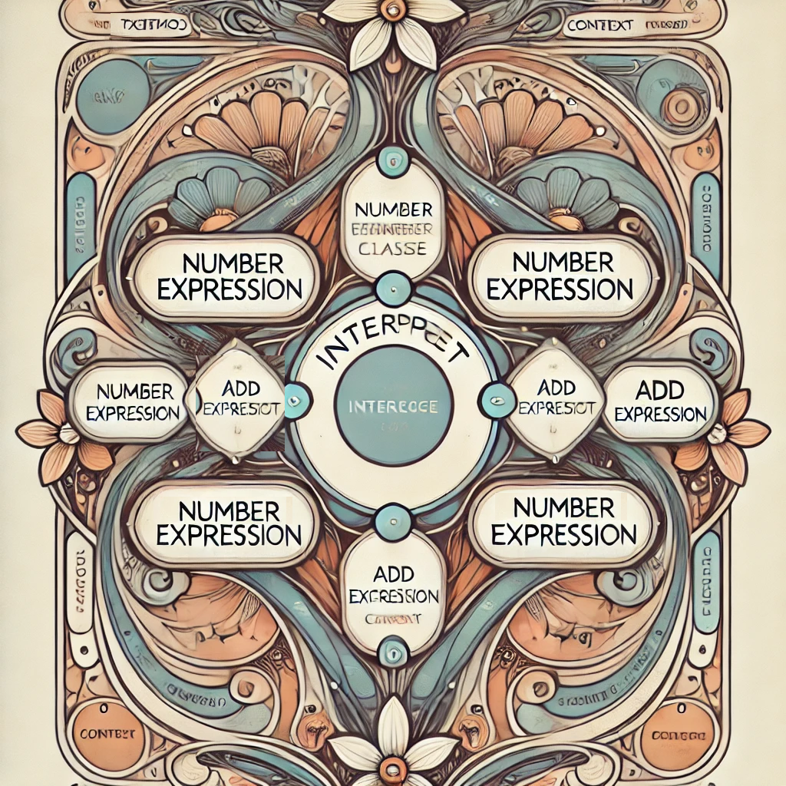

### Intérprete de Expresiones Aritméticas en C#

Este proyecto implementa el Patrón Interpreter en C# para evaluar expresiones aritméticas simples como 3 + 2 * 4, respetando la precedencia de operadores.

🛠 Características

✅ Implementa el Patrón Interpreter.

✅ Soporta suma (+) y multiplicación (*).

✅ Convierte una cadena en un árbol de expresión.

✅ Evalúa la expresión usando recursión.

📂 Estructura del Proyecto

📁 InterpreterArithmetic
│── Program.cs        // Punto de entrada
│── IExpression.cs    // Interfaz común
│── Number.cs         // Clase para números
│── Add.cs            // Operador suma
│── Multiply.cs       // Operador multiplicación
│── ExpressionParser.cs // Parser que convierte una cadena en un árbol
│── README.md         // Documentación

📜 Código Principal

1️⃣ Interfaz Común

interface IExpression
{
    int Interpret();
}

2️⃣ Clases para Operaciones

class Number : IExpression
{
    private int _value;
    public Number(int value) => _value = value;
    public int Interpret() => _value;
}

class Add : IExpression
{
    private IExpression _left, _right;
    public Add(IExpression left, IExpression right)
    {
        _left = left;
        _right = right;
    }
    public int Interpret() => _left.Interpret() + _right.Interpret();
}

class Multiply : IExpression
{
    private IExpression _left, _right;
    public Multiply(IExpression left, IExpression right)
    {
        _left = left;
        _right = right;
    }
    public int Interpret() => _left.Interpret() * _right.Interpret();
}

3️⃣ Parser de Expresiones

class ExpressionParser
{
    private Queue<string> tokens;

    public ExpressionParser(string expression)
    {
        tokens = new Queue<string>(Tokenize(expression));
    }

    private List<string> Tokenize(string expression)
    {
        List<string> tokens = new List<string>();
        string number = "";

        foreach (char c in expression)
        {
            if (char.IsDigit(c)) number += c;
            else if ("+-*/".Contains(c))
            {
                if (number != "") tokens.Add(number);
                tokens.Add(c.ToString());
                number = "";
            }
        }
        if (number != "") tokens.Add(number);
        return tokens;
    }

    public IExpression Parse()
    {
        return ParseAddSubtract();
    }

    private IExpression ParseAddSubtract()
    {
        IExpression left = ParseMultiplyDivide();

        while (tokens.Count > 0 && (tokens.Peek() == "+" || tokens.Peek() == "-"))
        {
            string op = tokens.Dequeue();
            IExpression right = ParseMultiplyDivide();
            left = (op == "+") ? new Add(left, right) : throw new NotImplementedException();
        }

        return left;
    }

    private IExpression ParseMultiplyDivide()
    {
        IExpression left = ParseNumber();

        while (tokens.Count > 0 && (tokens.Peek() == "*" || tokens.Peek() == "/"))
        {
            string op = tokens.Dequeue();
            IExpression right = ParseNumber();
            left = (op == "*") ? new Multiply(left, right) : throw new NotImplementedException();
        }

        return left;
    }

    private IExpression ParseNumber()
    {
        if (tokens.Count == 0) throw new Exception("Expresión inválida");
        return new Number(int.Parse(tokens.Dequeue()));
    }
}

4️⃣ Programa Principal

class Program
{
    static void Main()
    {
        string input = "3 + 2 * 4";
        ExpressionParser parser = new ExpressionParser(input);
        IExpression expression = parser.Parse();
        Console.WriteLine($"Resultado: {expression.Interpret()}"); // Output: 11
    }
}

🚀 Ejecución

🔧 Requisitos

.NET SDK instalado.

Compilador C#.

🏃 Ejecutar el programa

# Compilar
csc Program.cs IExpression.cs Number.cs Add.cs Multiply.cs ExpressionParser.cs

# Ejecutar
Program.exe

📌 Explicación

Tokenización (Tokenize()): Convierte "3 + 2 * 4" en ["3", "+", "2", "*", "4"].

Construcción del árbol (Parse()):

    (+)
   /   \
 (3)   (*)
      /   \
    (2)   (4)

Evaluación (Interpret()):

2 * 4 = 8

3 + 8 = 11

📌 Mejoras Futuras

✅ Soporte para resta (-) y división (/).
✅ Soporte para paréntesis ().
✅ Manejo de errores sintácticos.

📜 Licencia

Este proyecto es de código abierto y puedes usarlo libremente.

📌 Autor: Tu Nombre

